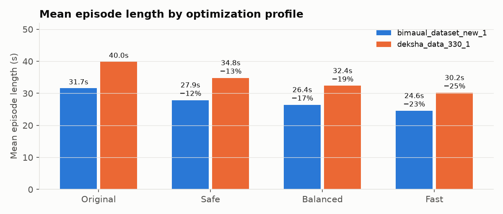
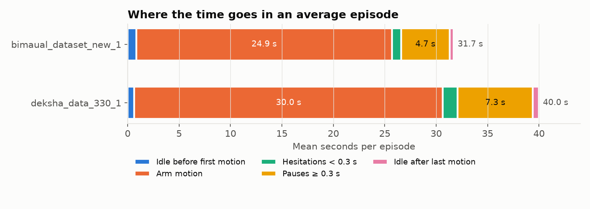
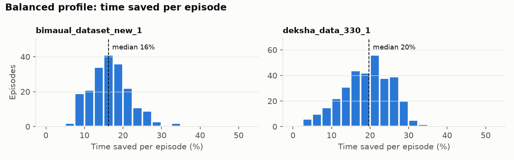
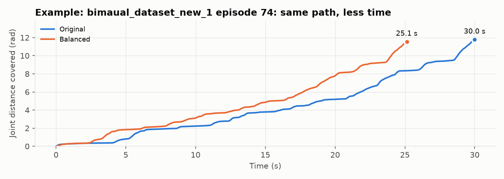
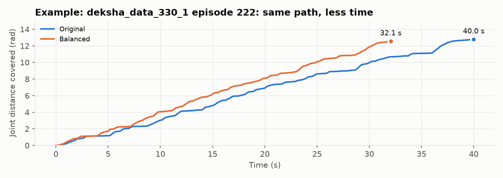

# Arm cycle-time analysis and optimization

Both datasets were analysed episode by episode, and every trajectory was retimed so the
arms reach the same poses in less time. The recorded joint path is kept exactly; only
the timing along it changes. Everything here is regenerated by:

```bash
pip install -r requirements.txt
python scripts/analyze.py    # per-episode metrics      -> reports/<dataset>/episode_metrics.csv
python scripts/optimize.py   # retiming, 3 profiles     -> reports/<dataset>/optimization_*.csv, optimized/
python scripts/report.py     # this report + figures
```

## Headline

| | bimaual_dataset_new_1 | deksha_data_330_1 |
|---|---|---|
| Mean episode length now | 31.7 s | 40.0 s |
| **Balanced profile (recommended)** | **26.4 s (−16.7%)** | **32.4 s (−19.1%)** |
| Safe profile (idle/pauses only, motion at demo speed) | 27.9 s (−12.0%) | 34.8 s (−12.9%) |
| Fast profile | 24.6 s (−22.5%) | 30.2 s (−24.5%) |

No episode got slower under any profile. The retimed motion stays within the 99th
percentile of joint speed and acceleration that the operators already used in these same
recordings, and in no episode does it peak higher than that episode's original recording.



## 1. What is in the data

|  | bimaual_dataset_new_1 | deksha_data_330_1 |
|---|---|---|
| Task | “pick the sprite bottle from the right box and place it in the left box” | “pick the bottles and place it in the box” |
| Robot | gen2 bimanual, 2 × (7 joints + gripper) = 16 values | same |
| Episodes (parquet / meta) | 201 / 203 | 330 / 330 |
| Frames (parquet / meta) | 191,098 / 192,898 | 395,811 / 395,811 |
| Total recorded time | 1.77 h | 3.67 h |
| Frame rate | 30 fps | 30 fps |
| Most common lengths | 30.03s×75, 30.0s×69, 40.0s×33 | 40.03s×193, 40.0s×136, 27.27s×1 |

Each frame has `observation.state` (measured joint positions) and `action` (commanded
positions) for 16 values: `left_joint_1..7`, `left_gripper_left_joint`, `right_joint_1..7`,
`right_gripper_right_joint`. Joints are in radians, grippers in metres (0 to 0.042).

**Data-quality issues found**

- **Fixed-length recordings.** Episode lengths are almost all exactly 25, 30 or 40 s, so
  recording ran on a timer instead of stopping when the task was done.
- **Episodes are cut off mid-motion.** In most episodes the arm is still moving in the
  final half-second (129 of 201 bimanual, 199 of 330 deksha), and the end pose is far from
  the start pose (median 0.45 / 0.37 rad on the most-moved joint). Some tasks or returns to
  home were probably truncated. Retiming can only shorten what was recorded.
- **Metadata mismatch in bimaual_dataset_new_1.** `meta/episodes.jsonl` and
  `meta/info.json` describe 203 episodes / 192,898 frames, but only 201 parquet files /
  191,098 frames exist, so 2 episodes are missing.
- **The command leads the measured position by 3 frames (100 ms)** in every episode. That
  is the controller's tracking lag, and it grows in distance as motion gets faster (see
  recommendations).
- A few frames have sensor spikes (up to 11.7 rad/s on `left_joint_7`). Limits use
  percentiles, so these do not inflate them.

## 2. Where the time goes



| Mean seconds per episode | bimaual_dataset_new_1 | deksha_data_330_1 |
|---|---|---|
| Episode length | 31.69 | 39.98 |
| Idle before first motion | 0.84 | 0.65 |
| Pauses ≥ 0.3 s (mid-task) | 4.69 | 7.31 |
| Hesitations < 0.3 s | 0.90 | 1.45 |
| Idle after last motion | 0.40 | 0.58 |
| At least one arm moving | 24.86 | 30.00 |
| Left arm moving | 9.59 | 15.23 |
| Right arm moving | 18.63 | 16.87 |
| Both arms moving together | 3.37 | 2.11 |
| Pauses per episode | 8.32 | 12.39 |
| Direction reversals per episode (> 0.02 rad) | 26.17 | 27.21 |
| Gripper open/close events per episode | 7.81 | 5.05 |
| Idle share of all recorded time | 21.6% | 25.0% |

Findings:

1. **About a quarter of all recorded time is idle** (22% bimanual,
   25% deksha). Almost all of it is **mid-task pauses**
   (8–12 per episode),
   not waiting at the start or end.
2. **The two arms take turns.** In deksha the left arm moves 15.2 s
   and the right 16.9 s per episode, but both together only
   2.1 s. In bimaual the right arm does about twice the work
   of the left (18.6 s vs 9.6 s).
3. **Lots of small corrections**: about 26 joint direction
   reversals larger than 0.02 rad per episode. Typical teleoperation "fine-tuning" near grasps.
4. **Motion is well below the arm's own demonstrated speed** most of the time. That speed
   headroom is what the balanced and fast profiles use.

## 3. How the optimization works

Implemented in [`armopt/retime.py`](../armopt/retime.py). For each episode:

1. **Split into motion segments and pauses.** A frame counts as moving if either arm's
   joint speed is above 0.05 rad/s or a gripper moves faster than 0.01 m/s. Gaps under 0.2 s are
   bridged, and bursts under 0.1 s are treated as noise. Hesitations under 0.3 s stay inside the motion.
2. **Trim idle** before the first and after the last motion (0.1 s kept on each side).
3. **Compress pauses.** Each pause is crossed as fast as the limits allow, but keeps at least
   0.1 s, or 0.3 s right after a gripper action so the grasp can settle.
4. **Retime each motion segment** with time-optimal path parameterization (a TOPP-style
   backward and forward pass over the path speed), starting and ending at rest, subject to
   per-joint velocity and acceleration limits and a maximum speed-up over the demo.
   The acceleration budget is split between following path curvature and changing speed.
   That keeps every sample feasible on noisy recorded paths (exact TOPP chattered
   between stop and full speed on encoder noise).
5. **Never slower than the demo.** If a segment can't be sped up within the limits, it
   keeps its original timing, which the robot has already executed.
6. **Both arms share one time map**, so bimanual coordination and hand-overs are unchanged.
   Output is resampled at 30 fps; `state` and `action` are interpolated at the same source
   times, and a `source_frame` column records where each output frame came from.

Cost: O(N·J) per episode (N frames, J = 16 joints), about 10 ms per episode. All
531 episodes × 3 profiles run in about 25 s.

**Joint limits** are the 99th percentile of |velocity| and |acceleration| observed while
that arm was moving, estimated separately per dataset. Units: rad/s and rad/s²
(grippers m/s and m/s²).

<details><summary>Per-joint limits used</summary>

| Joint | bimaual_dataset_new_1 vmax / amax | deksha_data_330_1 vmax / amax |
|---|---|---|
| left_joint_1 | 0.692 / 4.92 | 0.681 / 4.68 |
| left_joint_2 | 0.478 / 3.66 | 0.434 / 2.97 |
| left_joint_3 | 0.629 / 4.43 | 0.859 / 5.26 |
| left_joint_4 | 0.715 / 5.08 | 0.958 / 5.93 |
| left_joint_5 | 0.719 / 4.98 | 0.502 / 3.69 |
| left_joint_6 | 0.677 / 4.72 | 0.571 / 4.01 |
| left_joint_7 | 1.787 / 10.19 | 0.857 / 5.74 |
| left_gripper_left_joint | 0.131 / 0.89 | 0.119 / 0.81 |
| right_joint_1 | 0.699 / 4.33 | 0.689 / 4.84 |
| right_joint_2 | 0.528 / 3.63 | 0.493 / 3.59 |
| right_joint_3 | 0.869 / 5.39 | 0.852 / 5.38 |
| right_joint_4 | 0.917 / 5.31 | 0.977 / 5.87 |
| right_joint_5 | 0.859 / 5.50 | 0.189 / 2.26 |
| right_joint_6 | 0.860 / 5.40 | 0.382 / 3.09 |
| right_joint_7 | 1.373 / 7.89 | 0.558 / 3.95 |
| right_gripper_right_joint | 0.118 / 0.77 | 0.119 / 0.70 |

</details>

### Profiles

| Profile | Idle & pauses | Motion speed-up cap | Accel budget on curvature |
|---|---|---|---|
| `safe` | removed / compressed | 1.0× (demo speed) | – |
| `balanced` | removed / compressed | 2.0× | 50% |
| `fast` | removed / compressed | 3.0× | 70% |

## 4. Results

| Profile | Dataset | Mean episode | Time saved | Total | Median speed-up | Episodes slower | p99 vel / acc vs limit | Episodes with vel / acc peak above their demo |
|---|---|---|---|---|---|---|---|---|
| safe | bimaual_dataset_new_1 | 31.7 → 27.9 s | **12.0%** | 1.77 → 1.56 h | 1.13× | 0 | 0.11 / 0.37 | 0 / 0 |
| safe | deksha_data_330_1 | 40.0 → 34.8 s | **12.9%** | 3.67 → 3.19 h | 1.14× | 0 | 0.19 / 0.47 | 0 / 0 |
| balanced | bimaual_dataset_new_1 | 31.7 → 26.4 s | **16.7%** | 1.77 → 1.47 h | 1.19× | 0 | 0.87 / 0.78 | 0 / 0 |
| balanced | deksha_data_330_1 | 40.0 → 32.4 s | **19.1%** | 3.67 → 2.96 h | 1.25× | 0 | 0.96 / 0.80 | 0 / 0 |
| fast | bimaual_dataset_new_1 | 31.7 → 24.6 s | **22.5%** | 1.77 → 1.37 h | 1.28× | 0 | 0.95 / 0.88 | 0 / 0 |
| fast | deksha_data_330_1 | 40.0 → 30.2 s | **24.5%** | 3.67 → 2.77 h | 1.34× | 0 | 0.98 / 0.86 | 0 / 0 |

How to read the limit columns. The retimed motion is measured exactly as the limits
were measured on the demos (same smoothing, same derivatives), on the frames the
optimizer actually retimed.

- **"p99 vel / acc vs limit"** is the worst episode's 99th-percentile joint speed and
  acceleration as a fraction of the limit. At or below 1.0 means the optimized arm moves
  like the fastest 1% of the operators' own motion, and not faster.
- **Single-frame peaks** do go above the p99 limit (up to 2.5× in acceleration
  for balanced). But the original demos already peak at 1.9× (bimanual) and
  2.4× (deksha) of the same limits in a typical episode.
- **The last column** counts episodes whose optimized peak is higher than the same episode's
  original peak.

Per-episode numbers are in `reports/<dataset>/optimization_<profile>.csv`.







## 5. The biggest remaining lever: run the arms in parallel

The retimer keeps the demonstrated order of operations. But the arms take turns, so
overlapping their work could save much more. If each episode took only as long as its
busier arm:

| Dataset | Motion time now (mean) | If the arms fully overlapped (mean) | Upper bound on extra saving |
|---|---|---|---|
| bimaual_dataset_new_1 | 24.9 s | 18.7 s | 25% |
| deksha_data_330_1 | 30.0 s | 19.0 s | 37% |

That is an upper bound. It can't be applied by retiming the recordings: it needs task
knowledge (which steps depend on each other, e.g. a hand-over) and collision checks
between the arms. The practical route is to **collect demonstrations where both arms
work at once** (e.g. the free arm pre-positions for its next grasp while the other places).

## 6. Recommendations

1. **Train on `optimized/<dataset>`** (balanced profile) to get a policy that runs about
   17–19% faster.
   Or use `safe` first if you want zero change to motion speed.
2. **Replay a few optimized episodes on the robot before training.** The 100 ms tracking lag
   means faster motion drifts further behind the command, so check tracking error and grasp
   success. Step up from `safe` to `balanced` to `fast`.
3. **Retime the videos too.** The optimized parquet has no video; each output frame's
   `source_frame` gives the original frame to take (round to nearest) from
   `videos/.../episode_XXXXXX.mp4`.
4. **Fix data collection:** stop recording on task completion instead of on a timer (the
   capped episodes are likely truncated), and regenerate `meta/` for bimaual_dataset_new_1
   so it matches the 201 parquet files.
5. **Collect parallel bimanual demonstrations** (section 5); that is where the next large saving is.

## Files

| Path | What |
|---|---|
| `armopt/analysis.py` | motion/idle segmentation, per-episode metrics |
| `armopt/retime.py` | limit estimation, time-optimal retiming, profiles |
| `armopt/io.py` | LeRobot v2.1 reader/writer |
| `scripts/analyze.py`, `scripts/optimize.py`, `scripts/report.py` | pipeline entry points |
| `reports/<dataset>/episode_metrics.csv` | per-episode analysis |
| `reports/<dataset>/optimization_<profile>.csv` | per-episode before/after |
| `reports/<dataset>/limits.json` | per-joint limits used |
| `optimized/<dataset>/` | retimed dataset (balanced profile), LeRobot layout, state/action only |
| `tests/` | unit tests (`python -m pytest`) |
